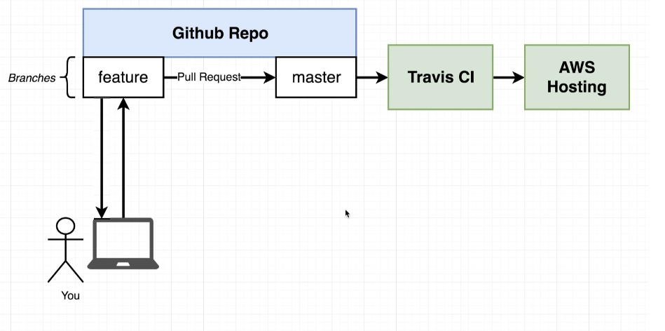

*****Dockerfile.dev for development environment and Dockerfile for prod environment*****

# Running a dockerfile with custom name
Go to frontend folder

_docker build -f Dockerfile.dev ._

frontend folder has react-app code that we ll wrap in docker. Once built App can be started with the following command.

_docker run -it -p 3000:3000 5b44aec3c710_

Any change in one of the codefile will require to re-build and run. We need a clever solution to handle by putting a reference of files and folders in local machine using Docker volumes, instead of doing a blind copy.

**Docker Volumes**
*docker run -it -p 3000:3000 -v /app/node_modules -v D:\Amit\Docker-Practice\production-workflow\frontend:/app 5b44aec3c710*

first -v without the colon says do not map it other maps all the folder in local dir to container dir

***** Docker-compose can be used to simplify the run command with docker volume*****
- A simple . with build will not work as dockerfile name for dev is different check the docker-compose.yml file

- Copy instruction in the dockerfile might not be required with docker volume and compose, but can be left as we might need it in prod

*docker-compose up*

